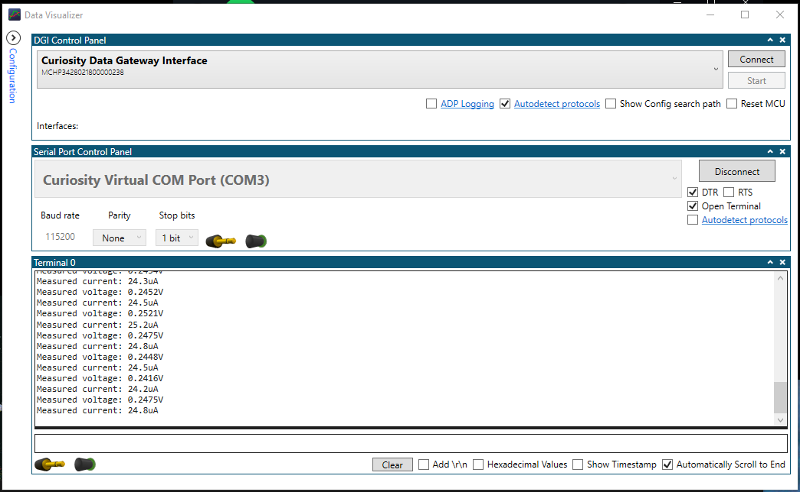
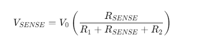
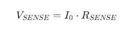
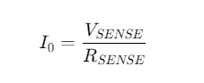
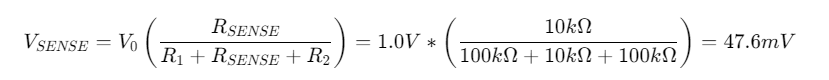
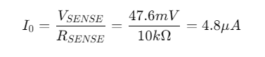

# Low-Power AVR® EA Current Sensing Measurements

This example shows how to use the AVR EA microcontoller to measure a current by using the Analog-to-Digital Converter (ADC) peripheral. The hardware needed, in addition to the microcontroller, are 2 × 100 kΩ resistors and one 10 kΩ resistor.

## Related Documentation

- [AVR64EA48 device page](https://www.microchip.com/wwwproducts/en/AVR64EA48)

## Hardware Used

- [AVR64EA48 Curiosity Nano](https://www.microchip.com/en-us/development-tool/EV66E56A)
- 2×100 kΩ resistor
- 10 kΩ resistor

## Setup

[

- The DAC0 OUT pin (PD6 on AVR64EA48) is connected to the ADC0 IN1 pin (PD1 on AVR64EA48) via resistor R1. The DAC0 OUT pin will generate the voltage (V0) we use as basis for emulating a current source.
- The ADC0 IN1 input pin (PD1 on AVR64EA48) is connected to the ADC0 IN0 pin (PD0 on AVR64EA48) via resistor RSENSE. This is the sensing resistor that is used to calculate the current I0.
- The ADC0 IN0 input pin (PD0 on AVR64EA48) is connected to ground (GND) via resistor R2

## Operation

- Connect the AVR64EA48 Curiosity Nano to a computer using a USB cable
- Download the zip file or clone the example to get the source code
- Open the .atsln file with Microchip Studio
- Press Start Without Debugging (CTRL+ALT+F5) to run the application

## View USART data in a terminal

This example uses USART1 to send data to the virtual serial port of the Curiosity Nano board. The data can be captured using a terminal application on the computer where the Curiosity Nano board is connected. This example uses a baud rate of 115200 with 8 bit data, 1 stop bit, no parity (standard format). This example shows the terminal view in the Atmel Data Visualizer standalone version.

[

## Theory

Some sensors, like photodiodes, phototransistors and some temperature sensors, will output a current signal. The 12-bit Analog-to-Digital Converter (ADC) peripheral can be used to measure the signal coming from such sensors.

The ADC can only convert a voltage. To measure a current, send the current through a "sense" resistor and measure the voltage drop across it. Then use this voltage to calculate the current.

This example will use the circuit shown under *Setup* to measure the current, where:

<!-- If your markdown viewer support equations, you can replace the image with this formula
$$
R_{1} = R_{2} = 100k\Omega
$$
$$
R_{SENSE} = 10k\Omega
$$
$$
V_{0} = 1V
$$
-->

Use the Digital-to-Analog Converter (DAC) peripheral as the "current source". Although this will give a defined voltage signal V0, the resistors in the circuit will create a current I0 that is given by:

<!-- If your markdown viewer support equations, you can replace the image with this formula
$$
I_{0} =  \frac{V_{0}} {R_{1} + R_{SENSE} + R_{2}}
$$
-->

The voltage divider rule gives the following equation for the voltage drop across RSENSE:

<!-- If your markdown viewer support equations, you can replace the image with this formula
$$
V_{SENSE} = V_{0} \left ( \frac{R_{SENSE}} {R_{1} + R_{SENSE} + R_{2}} \right)
$$
-->

(Detailed information about the voltage divider rule is out of the scope for this example, but can easily be found on the internet).

If we substitute with the expression for I0 (the same curent flows through all the resistors), we get:

<!-- If your markdown viewer support equations, you can replace the image with this formula
$$
V_{SENSE} = I_{0} \cdot R_{SENSE}
$$
-->

which leads to:

<!-- If your markdown viewer support equations, you can replace the image with this formula
$$
I_{0} = \frac{V_{SENSE}}{R_{SENSE}}
$$
-->

Since we know RSENSE, we can calculate the current by measuring the voltage drop across it.

The output voltage is set to 1V (DAC Out), and using the resistor values as listed in the beginning, we get:

<!-- If your markdown viewer support equations, you can replace the image with this formula
$$
V_{SENSE} = V_{0} \left ( \frac{R_{SENSE}} {R_{1} + R_{SENSE} + R_{2}} \right) = 1.0 V * \left ( \frac{10k\Omega} {100k\Omega + 10k\Omega + 100k\Omega} \right) = 47.6mV
$$
-->

<!-- If your markdown viewer support equations, you can replace the image with this formula
$$
I_{0} = \frac{V_{SENSE}}{R_{SENSE}} = \frac{47.6mV}{10k\Omega} = 4.8\mu A
$$
-->

In the example code, USART1 is used to output the measured voltage and calculated current to a terminal. To enable this the "#define USART_ON" must be included.

The Periodic Interrupt Timer (PIT), a part of the Real-Time Counter (RTC), is set up to generate an interrupt approximately each second to bring the device out of Sleep mode. When this happens, a counter is incremented and checked against a predefined period (10 seconds). During the Power-Down Sleep mode the 20 MHz clock source is disabled and only the internal 32 kHz oscillator and the RTC clock source is running.

If the value matches this period, the DAC is enabled to produce an output voltage of 1.8V and the ADC is enabled. The ADC is commanded to start a differential conversion immediately.  While the AD conversion is in progress, the CPU performs the calculations necessary for converting the previous ADC value into a voltage and a current. The results are printed to the terminal. As soon as this happens, the AD conversion is complete, the DAC and ADC are disabled, and the device goes back into sleep mode.

The AVR® EA is configured to stay in Power-Down sleep mode whenever a measurement is not in progress, to minimize the power consumption.

When measuring low-value signals like in this example, the PGA should be enabled to amplfiy the input signal to get better resolution on the measurement. In this example, the PGA gain amplify is set to 16x and the PGA BIAS set to 100% (since we are changing the main clock). Since PGA is used, the VIA bit fields of the MUXPOS and MUXNEG registers must be enabled.

## Conclusion

The following table shows the average current consumptions using different configurations (VDD = 3.3V):

|Main Clock | PGA Disabled (ADC), Average Current | PGA Enabled (ADC), Average Current | Relative Difference |
|:--------|:-------:|:------:|:-----:|
|2 MHz    |1.63 µA |1.42 µA | -13% |
|3.33 MHz |1.41 µA |1.33 µA | -6% |
|20 MHz   |1.14 µA |1.12 µA | -2% |

The measured current is reduced with increasing clock speeds, which seems somewhat counterintuitive. Since the device spend most of the time in a power-down sleep state and only wake for a brief period, this means that the total time in the Wake state is shorter with higher clock frequencies.

The average current consumption in the Wake state will be higher with increasing clock frequencies. But since the time spent in the Wake state is lowered with increasing clock frequency, this effect is more significant for this example, leading to lower average current consumption with increasing clock frequency.

The average current consumption done with the PGA enabled was lower than when the PGA was off. This does not follow the theoretical expected result that using the PGA should result in higher current consumption. Testing showed that by not entering sleep and sampling the ADC on each interrupt (each second) with the main clock at 20 MHz, the results were as expected:

| PGA | Average Current Consumption |
|:----|:---:|
|PGA OFF | 8.44 mA |  
|PGA ON | 9.01 mA |

When re-enabling the "timeout counter" so the ADC sampling only happens every 10 seconds, the measurements were:

| PGA | Average Current Consumption |
|:----|:---:|
|PGA OFF | 6.06 mA |  
|PGA ON | 6.06 mA |

This suggests that the higher average current consumption measured when PGA is off as compared to when the PGA is enabled in the initial measurement is due to a combination of the time between each ADC measurement and the code executing order.
