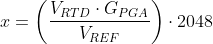

# Low-Power AVR EA Resistance Temperature Detector (RTD) Measurements

This example uses the AVR EA microcontroller to periodically drive
a Resistance Temperature Detector (RTD) with current, measure the
voltage across the RTD, and calculate both resistance and
temperature of the RTD. The hardware needed, in addition to the microcontroller, is a 1.8 kΩ fixed resistor and the RTD itself.

## Related Documentation

- [AVR64EA48 device page](https://www.microchip.com/wwwproducts/en/AVR64EA48)

## Hardware Used

- [AVR64EA48 Curiosity Nano](https://www.microchip.com/en-us/development-tool/EV66E56A)
- RTD pt100 Sensor
- 1.8 kΩ Resistor

## Setup

  

- The DAC0OUT (PD6 on AVR EA) pin of the device must be connected to the
VREFA (PD7 on AVR EA) pin of the device so that the Digital-to-Analog
Converter (DAC) output can be used to provide the reference voltage for
the Analog-to-Digital Converter (ADC)
- The 1.8 kΩ fixed resistor must be connected from the
DAC0OUT (PD6 on AVR EA) pin to the ADC0 AIN0 (PD0 on AVR EA) pin
- The RTD must be connected from the ADC0 AIN0 (PD0 on AVR EA) pin to ground
- The ADC0 AIN1 pin (PD1 on AVR EA) must be connected directly to ground

## Operation

- Connect the AVR64EA48 Curiosity Nano (Cnano) to a computer using a USB cable
- Download the zip file or clone the example to get the source code
- Open the .atsln file with Microchip Studio
- Press Start Without Debugging (CTRL+ALT+F5) to run the application

## Setting the target voltage on the Curiosity Nano board

This example uses the maximum allowed main clock frequency (10 MHz) at the default board voltage (3.3V). To use a higher clock frequency, the AVR64EA48 Curiosity Nano board target voltage must be set accordingly (VDD > 4.5V, see <i>Electrical Characteristics</i> in the Data Sheet). To do this, click the **Device Programming** button or enter (Ctrl + Shift + P) in Microchip Studio. Select the correct tool and device (if nothing else is connected, this is your default selected) and press the **Apply** button next to "Interface: UPDI". Now click "Tool Settings" in the left side menu, and write "5" in the "Generated" text field. Click the **Write** button, and the new voltage will be applied to the cnano board. This voltage will remain set until a new target voltage is written to the board.  

## Theory

To measure the RTD, the DAC is enabled to produce an output of approximately 1.8V. Since the DAC voltage is applied to a 1.8 kΩ fixed resistor in series with the RTD, the current flowing through the RTD will be under 1 mA. A current below 1 mA prevents the RTD from any significant self-heating. The ADC is used to measure the voltage across the RTD, and this allows the resistance and temperature of the RTD to be computed.  

The resistance of the RTD varies in a known way as a function of temperature (T), in accordance with the following equations, where A, B, and C are constants associated with the specific RTD and R0 is the resistance of the RTD at a temperature of 0 Celsius:

For T of 0°C or higher, R(T) = R0 * (1 + AT + BT2)

For T of -200°C to 0°C, R(T) = R0 * (1 + AT + BT2 + CT3 * (T -100) )  

If the resistance of the RTD is known, then the above formulas can be used to determine the temperature.  

Here are the relevant formulas for determining the resistance of the RTD:  

First, the voltage across the RTD is determined by the voltage divider equation, where RF is resistance of the fixed resistor and RTD is resistance of the RTD:  

<!-- If your markdown viewer support equations, you can replace the image with this formula
$$
V_{RTD} =\left ( \frac{R_{TD}}{R_{F} + R_{TD}}\right ) V_{REF}
$$
-->

The ADC digital result x, when the ADC is used in Differential mode, is determined by the following equation (from the data sheet):  

<!-- If your markdown viewer support equations, you can replace the image with this formula
$$
x = \left ( \frac{V_{RTD} \cdot G_{PGA}}{V_{REF}} \right) \cdot 2048
$$
-->

The voltage divider equation from above can be substituted in for VRTD and VREF cancels out:  

<!-- If your markdown viewer support equations, you can replace the image with this formula
$$
x = \left ( \frac{R_{TD}}{R_{F}+R_{TD}} \right) \cdot G_{PGA} \cdot 2048
$$
-->

This equation can be solved for RTD, the resistance of the RTD:  

<!-- If your markdown viewer support equations, you can replace the image with this formula
$$
R_{TD} = \frac{x \cdot R_{F}}{G_{PGA} \cdot 2048 - x}
$$
-->

Note that VREF does not appear in the equation at all, so errors in the reference voltage value will have no effect on the result. **The only parameters needed to compute the resistance of the RTD are the resistance value of the fixed resistor, the ADC result, and the PGA gain value.**

To minimize power consumption, the AVR EA is configured to stay in Power-Down Sleep mode whenever a measurement is not in progress. In this Sleep mode, AVR EA consumption was measured to approximately 0.9 µA (with VDD = 3.3V). The PIT (Periodic Interrupt Timer), a part of the RTC (Real Time Counter), is set up to periodically generate an interrupt to bring the device out of Sleep mode. In this example the period is set to 512, for 1 measurement every 0.5 seconds.  When this happens, the DAC is enabled to produce an output voltage of 1.8V and the ADC is enabled. The ADC is commanded to start a differential conversion immediately.  While the AD conversion is in progress, the CPU performs the calculations necessary for converting the previous ADC value into resistance and temperature. As soon as the AD conversion is complete and the result is saved, DAC and ADC are disabled and the device is put back to sleep.

When the DAC and ADC are both enabled after the device comes out of sleep, the DAC output stabilizes before the ADC is ready to start its first conversion, so there is no need for additional delays in the software.  

## Conclusion

Various strategies were tested to minimize power consumption (higher/lower CPU and ADC clock speeds, PGA on/off with less/more conversions), but in this case the overriding issue is the fact that the DAC must supply nearly 1 mA of current to the RTD sensor while AD conversions are in progress. Therefore the best strategy is to run both the CPU and ADC as fast as possible (10 MHz and 5 MHz clocks, respectively) with maximum PGA gain so the conversion time, and the time that the DAC must supply 1 mA, is minimized. During the Power-Down Sleep mode the 10 MHz clock source is disabled and only the internal 32 kHz oscillator and the RTC clock source are running. With this configuration, a burst of 16 ADC conversions takes only 155 µs.

During that 155 microseconds of conversion time with DAC enabled, microcontroller supply current was measured as 4.7 mA (this includes what is needed by the DAC to drive the RTD, with VDD = 3.3V). If there is one conversion per second, the average current will be:  
155 µs / 1s ×  mA = 1.55e-4 × 4.7 mA = 0.73 µA

Measured average current consumption is 0.9 µA + (0.73 µA) * n, where
n is the number of RTD temperature measurements per second:

|n         |Current Consumption (with VDD = 3.3V) |
|:--------:|------------------:|
|2         |2.4 µA |
|4         |3.7 µA |
|8         |6.6 µA |
|16        |12.3 µA |
|32        |23.8 µA |
|64        |46.8 µA |  
