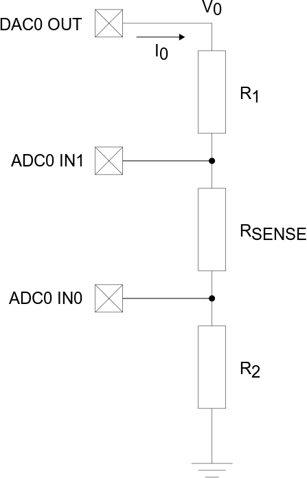
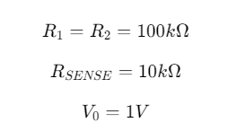
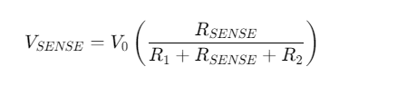
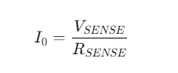
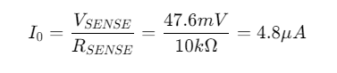

# Low-Power AVR® EA Current Sensing Measurements

This example shows how to use the AVR64EA48 microcontroller to measure a current by using the Analog-to-Digital (ADC) peripheral. Additional components are needed since the ADC can only sample a voltage signal.

Some sensors, like photodiodes, phototransistors and some temperature sensors, will output a current signal. Use the 12-bit ADC peripheral to measure the signal coming from such sensors. The ADC can only convert voltages. To measure a current, send the current through a "sense" resistor and measure the voltage drop across it.

## Related Documentation
- [AVR64EA48 device page](https://www.microchip.com/wwwproducts/en/AVR64EA48)

## Hardware Used
- [AVR64EA48 Curiosity Nano](https://www.microchip.com/en-us/development-tool/EV66E56A)
- Resistors 100k Ohm x2, 10k Ohm. 

## Operation
- Connect the AVR64EA48 Curiosity Nano to a computer using a USB cable
- Download the zip file or clone the example to get the source code
- Open the .atsln file with Microchip Studio
- Press Start Without Debugging (CTRL+ALT+F5) to run the application

## Setup

 Then use this to calculate the current.

This example will use the following circuit to measure the current:

where:

<!-- Add this once you place the code in GitHub
$$
R_{1} = R_{2} = 100k\Omega
$$
$$
R_{SENSE} = 10k\Omega
$$
$$
V_{0} = 1V
$$
-->

Use the Digital-to-Analog Converter (DAC) peripheral as "current source". Although this will give a defined voltage signal V0, the resistors in the circuit will create a current I0 that is given by:

<!-- Add this once you place the code in GitHub
$$
I_{0} =  \frac{V_{0}} {R_{1} + R_{SENSE} + R_{2}}
$$
-->

The voltage divider rule gives the following equation for the voltage drop across RSENSE:

<!-- Add this once you place the code in GitHub
$$
V_{SENSE} = V_{0} \left ( \frac{R_{SENSE}} {R_{1} + R_{SENSE} + R_{2}} \right)
$$
-->

(Detailed information about the voltage divider rule is out of the scope for this readme but can easily be found on the internet).

If we substitute with the expression for I0 (the same curent flows through all the resistors), we get:

<!-- Add this once you place the code in GitHub
$$
V_{SENSE} = I_{0} \cdot R_{SENSE}
$$
-->

which leads to:

<!-- Add this once you place the code in GitHub
$$
I_{0} = \frac{V_{SENSE}}{R_{SENSE}}
$$
-->

Since we know RSENSE, we can calculate the current by measuring the voltage drop across it.

The output voltage is set to 1V (DAC Out), and using the resistor values as listed in the beginning, we get:

<!-- Add this once you place the code in GitHub
$$
V_{SENSE} = V_{0} \left ( \frac{R_{SENSE}} {R_{1} + R_{SENSE} + R_{2}} \right) = 1.0 V * \left ( \frac{10k\Omega} {100k\Omega + 10k\Omega + 100k\Omega} \right) = 47.6mV
$$
-->

<!-- Add this once you place the code in GitHub
$$
I_{0} = \frac{V_{SENSE}}{R_{SENSE}} = \frac{47.6mV}{10k\Omega} = 4.8\mu A
$$
-->

In the example code, USART1 is used to output the measured voltage and calculated current to a terminal. To enable this the "#define USART_ON" must be included.

The Periodic Interrupt Timer (PIT), a part of the Real Time Counter (RTC), is set up to generate an interrupt approximately each second to bring the device out of sleep mode. When this happens, a counter is incremented and checked against a predefined period (10s). 

If the value matches this period, the DAC is enabled to produce an output voltage of 1.8 V and the ADC is enabled. The ADC is commanded to start a differential conversion immediately.  While the ADC conversion is in progress, the CPU performs the calculations necessary for converting the previous ADC value into a voltage and a current. The results are printed to the terminal. As soon as this happens, the ADC conversion is complete, the DAC and ADC are disabled, and the device goes back into sleep mode.

The AVR® EA is configured to stay in Power-Down sleep mode whenever a measurement is not in progress, to minimize the power consumption.

When measuring low-value signals like in this example, the PGA should be enabled to amplfiy the input signal to get better resolution on the measurement. In this example, the PGA gain is set to 16x and PGA BIAS set to 100% (since we are changing the main clock). Since PGA is used, the VIA bit fields of the MUXPOS and MUXNEG registers must be enabled.

## Conclusion

The following table shows the average current consumptions using different configurations (VDD = 3.3V):

|Main Clock | PGA Disabled (ADC), Average Current (uA)  | PGA Disabled (ADC), Average Current (uA) | Relative Difference | 
|:--------|:-------:|:------:|:-----:|
|2 MHz    |1.63 |1.42 | -13% |
|3.33 MHz |1.41 |1.33 | -6% |
|20 MHz   |1.14 |1.12 | -2% |

The current consumption is reduced with increasing clock speeds. This can seem somewhat counterintuitive, but consider that the device is mostly in a power-down sleep state, wake up each 1 second and then sample the ADC only each 10 seconds. This translates to lower average current consumption, since the current used in sleep mode is very low. Instant current consumption, which will be higher with higher clock frequencies, is not so significant since the time spent in this state is relatively short compared to time spent in the sleep mode.

The average current consumption done with the PGA enabled was lower than when the PGA was off. This does not follow the theoretical expected result that using the PGA should result in higher current consumption. Testing showed that by not entering sleep and sampling the ADC on each interrupt (each second) with the main clock at 20 MHz, the results were as expected:

| PGA | Average Current Consumption |
|:----|:---:|
|PGA OFF | 8.44 mA |  
|PGA ON | 9.01 mA |

When re-enabling the "timeout counter" so the ADC sampling only happens every 10 seconds, the measurements were:

| PGA | Average Current Consumption |
|:----|:---:|
|PGA OFF | 6.06 mA |  
|PGA ON | 6.06 mA |

This suggests that the higher average current consumption measurements when PGA is off is a combination of the time between the ADC measurements and the code executing order.

